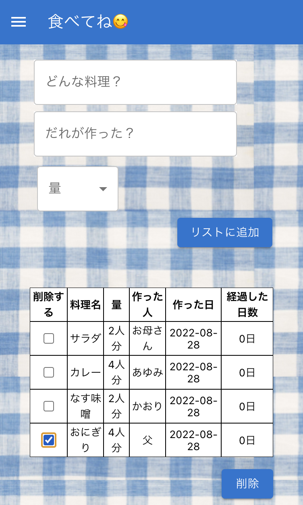

"このリポジトリは Code Chrysalis の生徒であるときに作成しました（This was created during my time as a student at Code Chrysalis）"

<br/>

## About this app

作り置きした料理の管理をするアプリです。

冷蔵庫に今どんな料理が残っているか分かります。

<br/>

## Requirement

以下のアプリケーションが必要です。
postgresql
node.js

また、postgresql では事前にデータベースの作成が必要です。

```
create database foods;
```

## Installation

リポジトリをクローンします。

```
git clone
```

依存ソフトウェアをインストールします。

```
npm i
```

環境ファイルを作成し、データベースのユーザー名、パスワードを追記します。

```
touch .env.local
```

```
DB_USER=username
DB_PASS=********
```

サーバーを起動します。

```

npm run start

```

クライアントアプリを起動します。

```

npm run hack

```

アプリの URL にアクセスします。
https://localhost:3000

<br/>

## How to use



料理の名前、作った人の名前、量を入力します。
「リストに追加」を押下すると、リストに追加表示されます。

食べ終わった後は「削除する」にチェックをし「削除」を押下するとリストから削除されます。

<br/>

## Sample

Heroku にデプロイしたサンプルの URL はこちらです。

```

https://soloproject2nd.herokuapp.com/

```
